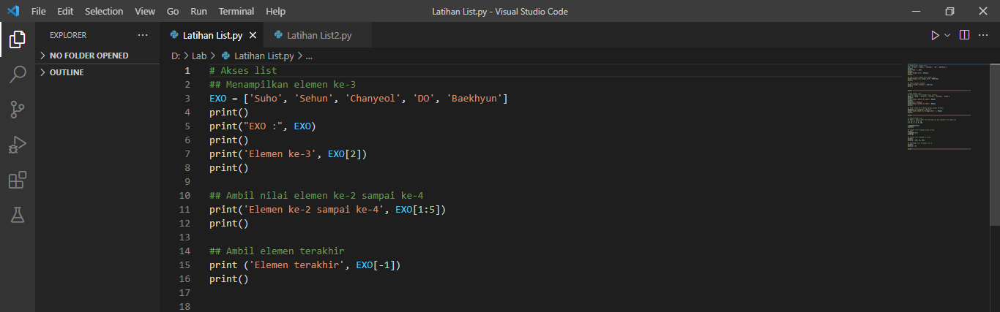
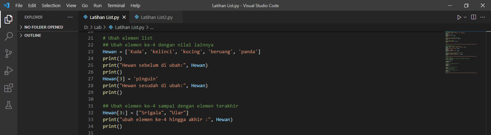
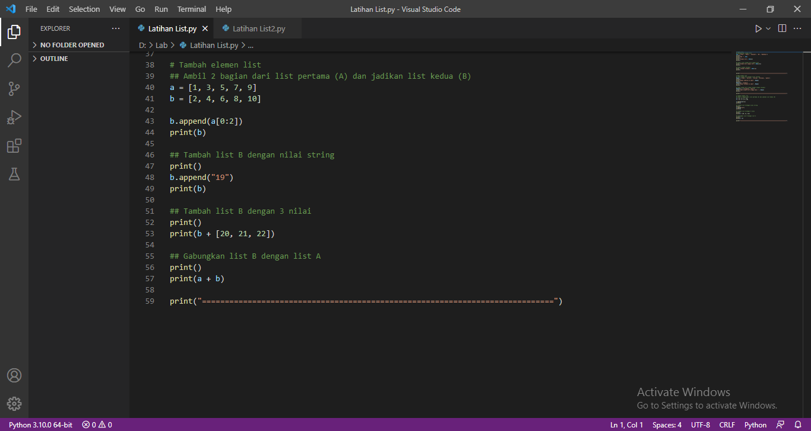
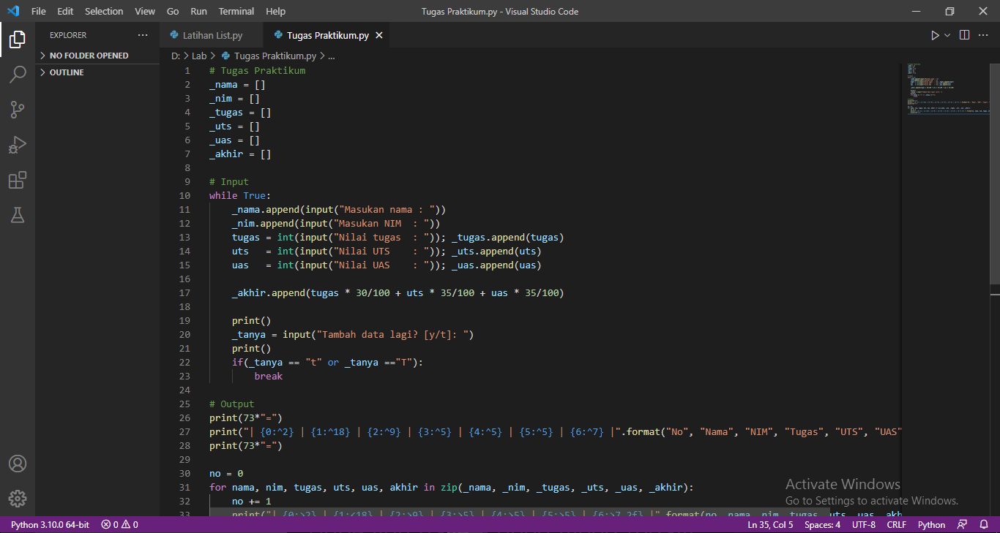
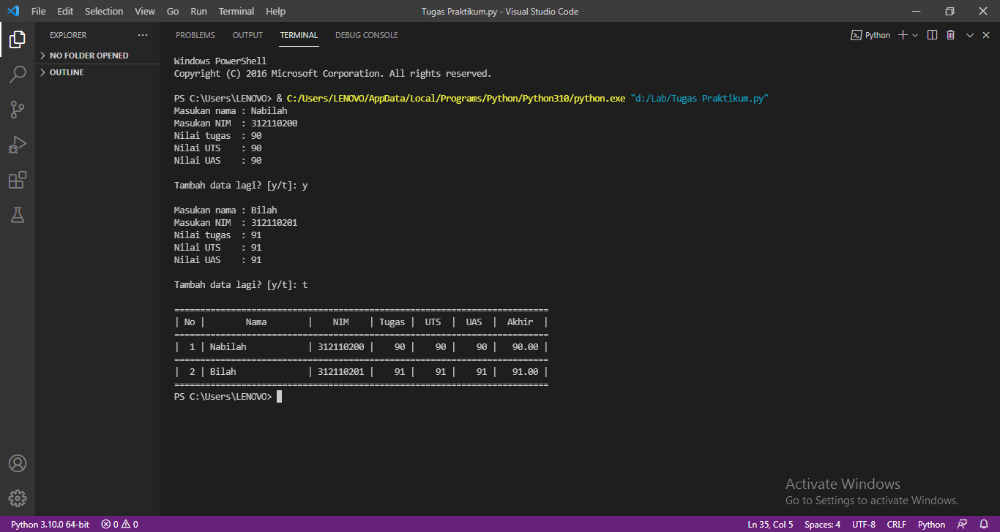

# Labspy04
## Latihan List

### Akses List
- Tampilkan elemen ke-3
- Ambil nilai elemen ke-2 sampai elemen ke-4
- Ambil elemen terakhir

#### Program


#### Penjelasan
1. Membuat list dengan nilai yang diinginkan
```python
EXO = ['Suho', 'Sehun', 'Chanyeol', 'DO', 'Baekhyun']
```

2. Menampilakn semua elemen yang terdapat pada list diatas
```python
print("EXO :", EXO)
```

3. Untuk menampilkan salah satu element dalam sebuah list dapat menggunakan `EXO[2]`
```python
print('Elemen ke-3', EXO[2])
```

4. Jika ingin mengambil elemen ke-2 sampai elemen ke-4 dapat menggunakan `EXO[1:5]`
```python
print('Elemen ke-2 sampai ke-4', EXO[1:5])
```

5. Jika ingin mengambil elemen terakhir dapat menggunakan `EXO[-1]`
```python
print ('Elemen terakhir', EXO[-1])
```
#### Output


### Mengubah Elemen List
- Ubah elemen ke-4 dengan nilai lainnya
- Ubah elemen ke-4 sampai dengan elemen terakhir

#### Program


#### Penjelasan
1. Membuat list dengan nilai yang diinginkan
```python
Hewan = ['Kuda', 'kelinci', 'kucing', 'beruang', 'panda']
```

2. Menampilakn semua elemen yang terdapat pada list diatas
```python
Hewan[3] = 'pinguin'
print("Hewan sesudah di ubah:", Hewan)
```

3. Jika ingin mengubah elemen ke-4 sampai dengan elemen terakhir dapat menggunakan `Hewan[3:]`
```python
Hewan[3:] = ["Srigala", "Ular"]
print("ubah elemen ke-4 hingga akhir :", Hewan)
```

### Output


### Menambahkan Elemen List
- Ambil 2 bagian dari list pertama (A) dan jadikan list ke-2 (B)
- Tambah list B dengan nilai string
- Tambah list B dengan 3 nilai
- Gabungkan list B dengan list A

#### Program


#### Penjelasan
1. Membuat list dengan variabel a dan b
```python
a = [1, 3, 5, 7, 9]
b = [2, 4, 6, 8, 10]
```

2. Untuk mengambil 2 bagian dari list a dan dijadikan list b
```python
b.append(a[0:2])
print(b)
```

3. Untuk menambahkan list b dengan nilai string 
```python
b.append("19")
print(b)
```

4. Untuk menambahkan list b dengan 3 nilai
```python
print()
print(b + [20, 21, 22])
```

5. Untuk menggabungkan list b dengan list a
```python
print()
print(a + b)
```

#### Output


## Tugas Praktikum
### Program sederhana untuk menambahkan data kedalam sebuat list 
#### Program


#### Penjelasan
1. Mendeklarasi list
```python
_nama = []
_nim = []
_tugas = []
_uts = []
_uas = []
_akhir = []
```

2. Gunakan perulangan _while loop_ dengan nilai "True"
```python
while True:
```

3. Menginput nama, nim, tugas, uts, uas, dan akhir dengan menambahkan method `.append`
```python
 _nama.append(input("Masukan nama : "))
    _nim.append(input("Masukan NIM  : "))
    tugas = int(input("Nilai tugas  : ")); _tugas.append(tugas)
    uts   = int(input("Nilai UTS    : ")); _uts.append(uts)
    uas   = int(input("Nilai UAS    : ")); _uas.append(uas)

    _akhir.append(tugas * 30/100 + uts * 35/100 + uas * 35/100)
```

4. Pada input <b>Tambah Data Lagi?</b> apabila jawaban “t” atau “T”, maka program akan berhenti dan akan menampilkan hasil daftar datanya
```python
_tanya = input("Tambah data lagi? [y/t]: ")
    print()
    if(_tanya == "t" or _tanya =="T"):
        break
```

5. Untuk membuat header table, menggunakan `print(73*"=")`, fungsinya membuat "=" sebanyak 73 sebagai garis, dan menggunakan format string
```python
print(73*"=")
print("| {0:^2} | {1:^18} | {2:^9} | {3:^5} | {4:^5} | {5:^5} | {6:^7} |".format("No", "Nama", "NIM", "Tugas", "UTS", "UAS", "Akhir"))
print(73*"=")
```

6. Deklarasi `no = 0` untuk membuat nomor pada isi table, lalu membuat perulangan dengan `for`
- Perulangan `nama, nim, tugas, uts, uas`, sesuai urutan yang ada di dalam `zip`
- Pada list yang dimaksud, `in zip` berfungsi untuk membungkus semua list
```python
no = 0
for nama, nim, tugas, uts, uas, akhir in zip(_nama, _nim, _tugas, _uts, _uas, _akhir):
```

7. Membuat isi tabel sesuai keinginan dengan format string
```python
no += 1    
    print("| {0:>2} | {1:<18} | {2:>9} | {3:>5} | {4:>5} | {5:>5} | {6:>7.2f} |".format(no, nama, nim, tugas, uts, uas, akhir))
```

8. Untuk membuat footer atau garis paling bawa ketika looping isi table selesai
```python
print(73*"=")
```

#### Output


#### Selesai

